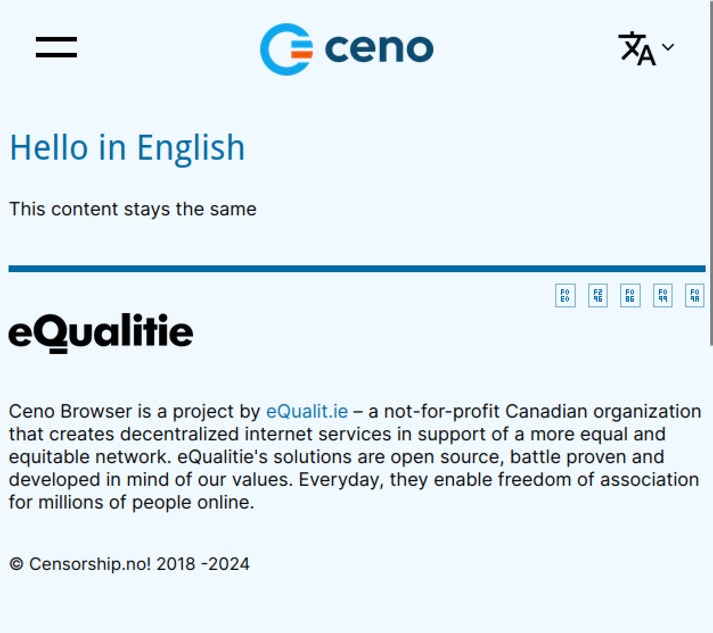

Lets say we have an example page that looks like this in english:

`_en.dev/example.html:`
```html 
<h2 id="ReplaceThis">Hello in English</h2>
<p>This content stays the same</p>
```

We can now add a file `_fr.overwrite/example.html` and add the following:
```html
<div id="ReplaceThis">
    <p>SOMETHING VERY FRENCH! 🇫🇷</p>
    <ul>
        <li>Olympics</li>
        <li>omelette du fromage</li>
    </ul>
</div>
```

When we now publish the site, the full contents of `fr/example.html` will contain the following:
```html
HEADER CONTENT
<div id="ReplaceThis">
    <p>SOMETHING VERY FRENCH! 🇫🇷</p>
    <ul>
        <li>Olympics</li>
        <li>omelette du fromage</li>
    </ul>
</div>
<p>This content stays the same</p>
FOOTER
```

The tag replacement procedure replaces html tags based on id, so we can even change the type of the tag in the content for different locales. Using this we can design separate landing page layouts, and add arbitrary unique content for individual locales in a way that plugs in with the rest of the existing workflow.

Here is a screenshot showing the before and after of adding these rewrite rules.


